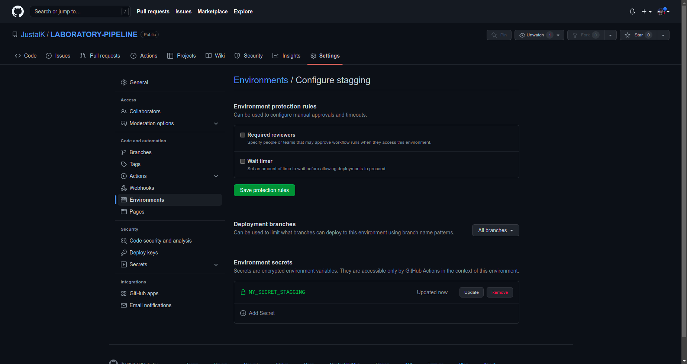
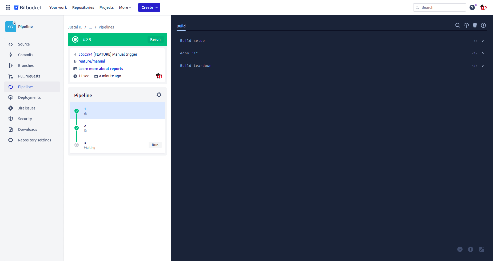

# LABORATORY-PIPELINE

Warning: The case of the name of the branches are important for any pipelines

## GitHub

#### Experiences


I have created many actions on this repositories for testing how it exactly works. Those are the different things that has been tested:

- Running a bash script
- Testing the concurrency by grouping actions
- Testing the dispatch for manually running action with inputs
- Playing with the context
- Testing the output and sharing information between jobs
- Creating a scheduled actions
- Playing with the secrets by environment and global secrets
- Creating a pipeline for CI

#### Errors & fixes

Some information that might be useful if you get a permission error with the scripts. You can set the permission with the commands below:

```bash
$ git update-index --chmod=+x ./.github/scripts/hello.sh
```

#### Triggerring action manually

For starting an action by CURL:

```bash
curl -X POST -H "Accept: application/vnd.github+json" -H "Authorization: Bearer <BEARER TOKEN>" "https://api.github.com/repos/justalk/LABORATORY-PIPELINE/actions/workflows/dispatch.yml/dispatches" -d '{"ref":"feature/check-github-pipeline","inputs":{"testVariable":"KEVIN", "environment":"stagging"}}'
```

#### Defining secret

Everything happen in the `Setting` tabs, in the `Secret` menu.


However for defining secret be environment, we can only define the secret from inside the environment.




#### Continuous Integration

I have created a **React** project using **NX**. I created an action testing the builds and tests on two different jobs using a matrix around the os. I have put a rule on concurrency for blocking multiple action to run if I keep pushing. I am using npx because you cannot access directly the command nx. I added the workflow_dispatch for manually running the pipeline when I want.

```
name: CI

on:
  workflow_dispatch:
  push:
  pull_request:

permissions: read-all

concurrency:
  group: ${{ github.ref }}
  cancel-in-progress: true

jobs:
  build:
    strategy:
      matrix:
        os: [ubuntu-22.04, ubuntu-20.04]
    runs-on: ${{ matrix.os }}
    steps:
      - uses: actions/checkout@v3
      - name: Use Node.js
        uses: actions/setup-node@v3
        with:
          node-version: "16.x"
      - name: Install CI
        working-directory: ./project
        run: npm ci
      - name: Build the apps
        working-directory: ./project
        run: npx nx build
      - name: Run the test
        working-directory: ./project
        run: npx nx test
```

## Bitbucket

I went through the entire documentation for testing the possibilities compared to GitHub. Everything can be found in the `bitbucket-pipeline.yml`. I tested:

- how to use artifacts
- How to use the caches
- How to create step in parallel
- Run a script after completion
- Manual trigger step and creating manual pipeline
- Naming of PR, default and branches of pipeline
- How to use secret

#### Skipping the CI when push

Just add the message `[skip ci]` in the commit to skip the CI.


#### Pipeline custom

By using `custom`, you can create manual pipelines with variables. Those pipelines can be triggered in the `pipeline` pages:


#### Manual trigger

Step can be put as `trigger: manual` which let only the push possible through the web interface. When a step require a manual intervention, the symbol change a bit:


If you go in the pipeline, a button `run` will be available and ready to be pressed for starting the next step:



#### Secrets

For defining secrets, go inside the `Repository Settings` which is at the bottom of the repository you are working on. At the bottom, in the section `pipeline`, there are two menu: `Repository Variables` and `Deployement`.

The repository variables will be accessible through all the pipeline while the one from deployement will only be available if the `deployement` field in the pipeline match the one define in the web.


#### Caching

- Any cache which is older than 1 week will be cleared automatically and repopulated during the next build.
- Warning: If the cache define is empty, it wont be cached. So careful when the workdirectory is different from where we cache. For example, the `node_modules` in this repository will be in the `project` folder. If I define the cache such as `node`, it wont be cache because the node_modules will be expected at the root. This iw hy I change the definition of my cache at the bottom.

You can see the download of the cache:


And the cache can be download or deleted from the main pipelines page:


#### Artifacts

Artifacts is kinda like cache at one difference, it will be only available in the current pipeline. A cache is however available through the different pipeline.

When you define an artifact, it can be seen in the logs.


The artifacts can be download in the tab `artifact` present in the pipeline.


#### Continuous Integration


A simple CI would be as followed. In the first step, I will install the dependencies and build the app. The compiled project will be put in an artifact while the dependencies put in the cache for the next pipelines. The second step will validate the project. In my case, I only have unit test and the linter. I did that in parallel since one job does not block the other one. Last step will be for the deployement (see next point).

```
  branches:
    master:
      - step:
          name: "Install the dependencies"
          caches:
            - frontendnode
          script:
            - cd project
            - npm ci
            - npx nx build
          artifacts:
            - project/dist/**
          after-script:
            - echo "Installation and build of the project done"
      - parallel:
          - step:
              name: "Test the linting"
              caches:
                - frontendnode
              script:
                - cd project
                - npx nx lint
              after-script:
                - echo "Linting OK"
          - step:
              name: "Test the application"
              caches:
                - frontendnode
              script:
                - cd project
                - npx nx test
              after-script:
                - echo "Test OK"
      - step:
          name: "Deployement"
          trigger: manual
          script:
            - echo "Step to do for deploying SCP"
          after-script:
            - echo "Deployement OK"
```

#### Continuous Deployement

If we want to deploy the website at the end of the pipeline, we need to use the following step. You also certainly need to define multiple secret depending of the environment you want to deploy on.

```
- step:
      name: Deploy to XXX
      deployment: XXX
      script:
      - echo "Deploying to XXX environment"
      - pipe: atlassian/ssh-run:0.2.2
        variables:
            SSH_USER: $SERVER_USER
            SERVER: $SERVER_IP
            COMMAND: 'bash ./deploy.sh'
      - pipe: atlassian/slack-notify:2.0.0
        variables:
          WEBHOOK_URL: 'https://hooks.slack.com/services/yyyy/xxxx/zzzz'
          MESSAGE: 'A random message'
```

```bash
git pull
echo '## deploy.sh: Installing the packages in any case there is new one'
npm install
echo '## deploy.sh: Seeding the database'
npm run seed
echo '## deploy.sh: Reloading the nodes'
pm2 reload all
```

## GitLab

Since I like to keep money in my pocket, the first step is to register a runner. I will need all the information for connecting the runner, go in your repository, click on the `Settings` at the bottom and expand the menu `Runner`:


You will need the information for completing the following command.

```bash
$ sudo gitlab-runner register
```


If everything went well, you should see you runner below. Dont forget to desactivate the `Shared Runner`.


